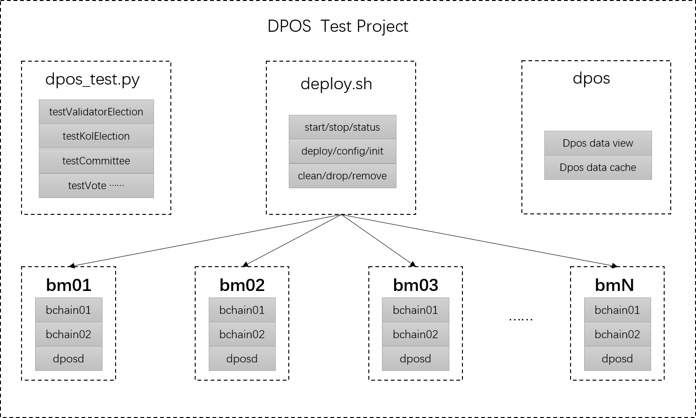

# DPOS Test Project



# What is this

A test project for BuChain, include:

1. A multi-instance multi-node cluster automation deploy tool
2. A bumo function and performance test program
3. A web service to view dpos data

# How to run test

## 1. Download test porject

```txt
http://192.168.1.11/bugit/buproject/blob/master/docs/consensus/other/dpos
```

## 2. Upload dpos.tgz to bumo environment

```txt
[root@d01 ~]# ls
dpos.tgz

[root@d01 ~]# tar -xvf dpos.tgz -C /root/
```

## 3. Build mutual trust for all bumo nodes

```txt
[root@d01 dpos]# cat /etc/hosts
192.168.21.41 d01
192.168.21.42 d02
192.168.21.43 d03
192.168.21.44 d04
[root@d01 dpos]# ssh-keygen -t rsa
[root@d01 dpos]# ssh-copy-id -i /root/.ssh/id_rsa.pub d01
[root@d01 dpos]# ssh-copy-id -i /root/.ssh/id_rsa.pub d02
[root@d01 dpos]# ssh-copy-id -i /root/.ssh/id_rsa.pub d03
[root@d01 dpos]# ssh-copy-id -i /root/.ssh/id_rsa.pub d04
```

## 4. Modify cluster managermant script

```txt
[root@d01 dpos]# head -n 8 dayurc
#!/bin/bash

#
#  A simple script to ease the management of BuChain cluster
#

# Note, the all hostnames should be in /etc/hosts
dhosts="d01 d02 d03 d04"
```

## 5. Initialize cluster managermant tool

```txt
[root@d01 dpos]# source dayurc
Help:
        usage       - command list
        ra          - run a command on all nodes
        rap         - run a command on all nodes in paralell
        fsync       - sync files or dirs among all nodes
        tsync       - sync time among all hosts
        dstart      - start bumod on all nodes
        dstop       - stop bumod on all nodes
        dstat       - get bumod status on all nodes
        pstart      - start bumod on all nodes in parallel
        pstop       - stop bumod on all nodes in parallel
        haltall     - halt all nodes
        rebootall   - reboot all nodes
Hosts:
        1  d01
        2  d02
        3  d03
        4  d04
```

## 6. Sync deploy script to all nodes

```txt

[root@d01 dpos]# ls
dayurc     dposd    dpos.log  dpos_test.py  README.md   statics    test.cfg
deploy.sh  dpos.db  dpos.py   model         restart.sh  stress.sh

[root@d01 dpos]# fsync dposd
```

Util now, the cluster managerment tool already deploy done.

And then we will deploy two bumo instance on each node(Ignore if you just need cluster managerment tool).

## 7. Deploy bumo instance

```txt
[root@d01 dpos]# pip
-bash: pip: command not found
[root@d01 dpos]# python get-pip.py
[root@d01 dpos]# pip install requests
[root@d01 dpos]# ./deploy.sh -h
Usage:
    Options:
        -h  show help message
        -c  command mode
            deploy: Deploy bumo to all nodes
            mod:    Modify and update configuration
            init:   Re-init and start bumo program
            clean:  Clean test environment
            stop:   Stop all bumo instance
            start:  Start all bumo instance
            clean:  Clean all log and coredump files
            drop:   Drop db for bumo instance
            remove: Remove bumo instance
        -d  bumo install directory, new instance will copy from here
        -i  bumo instance per node
        -l  node list to deploy
        -g  keypairs generation program, dpos_test.py
        -b  bumo build directory, binary file bin/bumo will update from here

    Prepare:
        Build ssh mutual-trust for all nodes and then download and compile bumo program.

    Getting Started:
        1. ./deploy.sh -c deploy -d /root/dpos/bchain -i 5 -l "d01 d02 d03"
        2. ./deploy.sh -c mod -d /root/dpos/bchain -i 5 -l "d01 d02 d03" -g "/root/dpos/dpos_test.py"
        3. ./deploy.sh -c init -d /root/dpos/bchain -i 5 -l "d01 d02 d03" -b "/root/dpos/bumo-1.3.0"

[root@d01 dpos]# ./deploy.sh -c deploy -d /root/dpos/bchain -i 2 -l "d01 d02 d03 d04"

[root@d01 dpos]# ./deploy.sh -c mod -d /root/dpos/bchain -i 2 -l "d01 d02 d03 d04"

[root@d01 dpos]# ./deploy.sh -c init -d /root/dpos/bchain -i 2 -l "d01 d02 d03 d04"
```

Now, all bumo instance will be start, check bumo status

```txt
[root@d01 dpos]# ./deploy.sh -c status -d /root/dpos/bchain -i 2 -l "d01 d02 d03 d04"
```

There is more function waiting for you to discovery, hope you enjoy it.

## 8. Run dpos test

a. Update some configuration in dpos_test.py, like genesis_account and init_committee.

b. Get dpos_delegate.js dpos.js to local directory

```txt
[root@d01 kk]# ./dpos_test.py -h
Usage :

    Name:
        dpos_test.py - bumo python api test
    Synopsis:
        dpos_test.py -c [command] [options...]
    Description:
        Arguments are as following:
            -h  print the help message
            -c  command
            -f  keypairs file path
            -U  upgrade dpos contract, work with -c init

    Example:
        dpos_test.py -c genKeyPairs|testPayCoin|testCreateAccount|testIssueAsset -n number [-o numOpPerTx] [-s startNonce] [-f keypairs]
        dpos_test.py -c dumpLedgerView -n span [-o startSeq]
        dpos_test.py -c getTps -n startSeq [-o endSeq]
        dpos_test.py -c init|updateCfg|testValidatorElection|testKolElection|testCommittee [-f keypairs] [-U] [-p key=value]
        dpos_test.py -c dposTest|testAbolish|cleanProposal [-p malicious|item,operate,address]
        dpos_test.py -c initVote|testVote|testUnVote [-p 'mode=compete,voter_num=5,candidate_num=5']
        dpos_test.py -c str2Hex|hex2Str -p raw_string|hex_string
        dpos_test.py -c getModulesStatus|getAccount|getLedger|getTransactionHistory|list

[root@d01 dpos]# grep -E "^base_url.*=|^genesis.*=|^init_committee.*=" dpos_test.py
base_url = 'http://127.0.0.1:36012/'
genesis_account = 'buQs9npaCq9mNFZG18qu88ZcmXYqd6bqpTU3'
genesis_priv_key = 'privbvYfqQyG3kZyHE4RX4TYVa32htw8xG4WdpCTrymPUJQ923XkKVbM'
init_committee = {'buQZoJk8bq6A1AtsmfRw3rYJ79eMHUyct9i2': 'privbt8Qg7h2YDDZqMRTuTG34SMzNXREdm8UQUtBpVDHk6e5xA54GTZ2',

[root@d01 dpos]# ls
dpos_delegate.js dpos.js ……

[root@d01 dpos]# ./dpos_test.py -c init

[root@d01 dpos]# ./dpos_test.py -c dposTest

```

## 9. View validators change

Start web service dpos.py and access the url from browser

```txt
[root@d01 dpos]# pip install web-py
[root@d01 dpos]# ./restart.sh
Please use the browser to open:
http://192.168.21.41:36010
```
